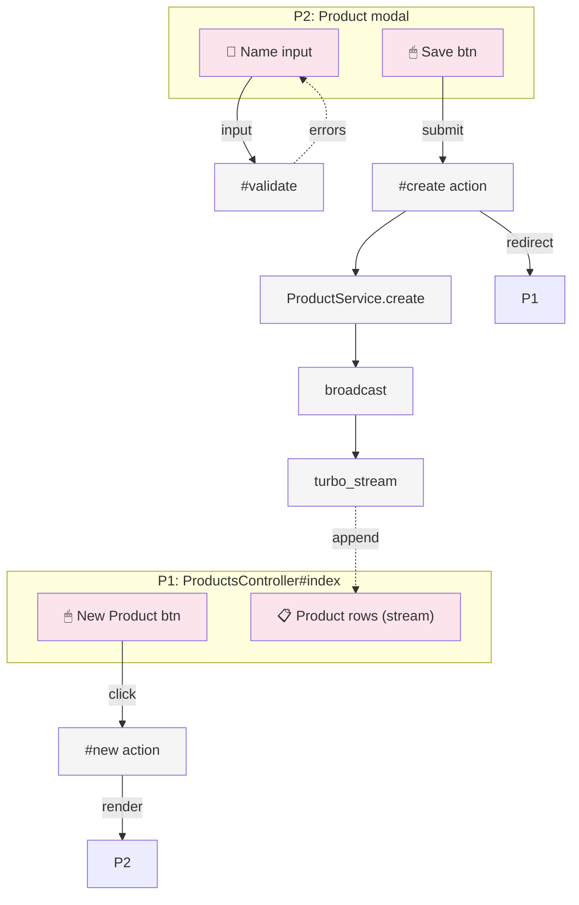

# Hotwire/Turbo Breadboarding Reference

System mapping technique adapted from Shape Up methodology for
Rails Hotwire/Turbo features. Produces affordance tables and wiring
diagrams that feed directly into plan task generation.

## When to Breadboard

Breadboard when the feature involves:

- 2+ pages or components with shared state
- Complex event flows (Turbo Streams, multi-step forms)
- Navigation between multiple routes
- Real-time collaboration or multi-user updates

Skip breadboarding for single-page CRUD or trivial features.

## Core Concepts

### Places

A **Place** is a bounded context where the user has specific
affordances available. Test: "Can you interact with what's behind?"
If no, it's a different Place.

| Rails/Turbo Concept | Place? | Why |
|---------------------|--------|-----|
| Full page | Yes | Full page context |
| Modal (turbo-frame) | Yes | Blocks interaction behind |
| Inline edit mode | Yes | Replaces display affordances |
| Tab panel | Yes | Different affordance set |
| Dropdown/tooltip | No | Overlay, parent still active |
| Flash message | No | Ephemeral, no affordances |

### UI Affordances (U)

User-visible interactive elements. Map to Rails views and helpers.

| Type | Rails Pattern | Example |
|------|---------------|---------|
| Button | `data-action` | `<button data-action="click->controller#method">` |
| Form input | `form_with` | `<%= f.text_field :name %>` |
| Link/navigate | `link_to` / `turbo_frame` | `<%= link_to "Show", post_path(post), data: { turbo_frame: "modal" } %>` |
| Display | instance variables | `<%= @user.name %>` |
| Dynamic list | Turbo Stream | `<%= turbo_stream_from @post %>` |
| Upload zone | Active Storage | `<%= f.file_field :avatar, direct_upload: true %>` |

### Code Affordances (N)

Callable mechanisms. Map to Ruby methods and callbacks.

| Type | Rails Pattern | Example |
|------|---------------|---------|
| Controller action | `def action` | `def create; ...; end` |
| Turbo Stream broadcast | `Turbo::StreamsChannel` | `Turbo::StreamsChannel.broadcast_append_to` |
| Stimulus controller | `stimulus_controller` | `data-controller="sortable"` |
| Service method | Service object | `OrderService.create(params)` |
| Callback | `before_action` | `before_action :authenticate_user!` |
| PubSub | ActionCable | `ActionCable.server.broadcast` |

### Data Stores

Persistent and session state that UI reads from.

| Type | Rails Pattern | Example |
|------|---------------|---------|
| Database | Active Record | `User.all`, `Post.find(id)` |
| Session | `session` hash | `session[:user_id]` |
| Flash | `flash` hash | `flash[:notice] = "Saved"` |
| Instance variable | `@variable` | `@posts = Post.all` |
| Turbo Stream | `turbo_stream` | `turbo_stream.append :posts` |
| Cache | Rails.cache | `Rails.cache.fetch(key)` |

### Wiring

Two types of connections between affordances:

- **Wires Out** (control flow): What an affordance triggers.
  Solid arrows in diagrams. `data-action="click->controller#submit"`
  wires to `MyController#submit`
- **Returns To** (data flow): Where output goes. Dashed arrows.
  `OrderService.create()` returns to `@order` variable

## Affordance Tables Format

Every breadboard produces these tables in the plan:

### Places Table

| ID | Place | Entry Point | Notes |
|----|-------|-------------|-------|
| P1 | ProductsController#index | `/products` | Main listing |
| P2 | Product modal | click "New" | Modal over P1 |
| P3 | Product show | click item row | Separate page |

### UI Affordances Table

| ID | Place | Component | Affordance | Type | Wires Out | Returns To |
|----|-------|-----------|------------|------|-----------|------------|
| U1 | P1 | header | "New Product" button | click | N1 | - |
| U2 | P2 | form | name input | input | N2 | - |
| U3 | P2 | form | "Save" button | submit | N3 | - |
| U4 | P1 | table | product rows | turbo-stream | - | from S1 |

### Code Affordances Table

| ID | Place | Module | Affordance | Wires Out | Returns To |
|----|-------|--------|------------|-----------|------------|
| N1 | P1 | ProductsController | new action | render P2 | - |
| N2 | P2 | ProductForm | validate | - | U2 errors |
| N3 | P2 | ProductsController | create action | N4, redirect | - |
| N4 | - | ProductService | create(attrs) | N5 | S1 |
| N5 | - | Product | broadcast | N6 | - |
| N6 | P1 | ProductsController | turbo_stream | - | S1 (append) |

### Data Stores Table

| ID | Store | Type | Read By | Written By |
|----|-------|------|---------|------------|
| S1 | products list | turbo-stream | U4 | N4, N6 |
| S2 | form data | form state | U2, U3 | N2 |
| S3 | products table | database | N4 | N4 |

## Fit Check (Optional)

When multiple solution approaches exist, compare them:

| Requirement | Shape A: Turbo + Modal | Shape B: Separate Pages |
|-------------|------------------------|------------------------|
| Inline editing | ✅ | ❌ |
| URL-shareable | ❌ | ✅ |
| Real-time updates | ✅ | ✅ |
| Mobile friendly | ❌ (modal) | ✅ |

Use ✅/❌ only. Flag unknowns with ⚠️ — these need a spike task
in the plan before committing to the approach.

## Spike Markers

When an affordance or wiring has an unknown implementation:

```markdown
| N7 | - | Payments | charge_card(token) | ⚠️ | S4 |
```

⚠️ means: "We know WHAT but not HOW." Each ⚠️ becomes a spike
task in the plan:

```markdown
- [ ] [P0-T1][direct] Spike: Evaluate Stripe integration for charge_card
  **Unknown**: Can we use Stripe's PaymentIntent API with Turbo?
  **Success criteria**: Working proof-of-concept with test mode key
  **Time-box**: 30 minutes max, then decide or ask user
```

## Mermaid Diagram (Optional)

For complex features, generate a visual:



Conventions:

- **Solid arrows** (`-->`) = control flow (Wires Out)
- **Dashed arrows** (`-.->`) = data flow (Returns To)
- **Pink** = UI affordances
- **Grey** = Code affordances

## From Breadboard to Plan Tasks

The breadboard drives task generation:

1. **Each Place** → potential controller/view/component task
2. **Each Code Affordance group** → service/model task
3. **Each wiring cluster** → integration task
4. **Each ⚠️** → spike task (Phase 0)
5. **Each Data Store** → schema/migration task

Group by vertical slice (working increment), not by layer:

```markdown
## Phase 1: Product Listing [PENDING]
(covers: P1, U4, N6, S1 — the read path)

## Phase 2: Product Creation [PENDING]
(covers: P2, U1-U3, N1-N5 — the write path)
```

Each phase should be demonstrable — a working vertical slice.
